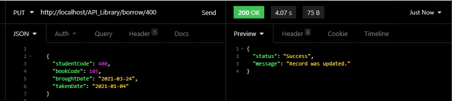
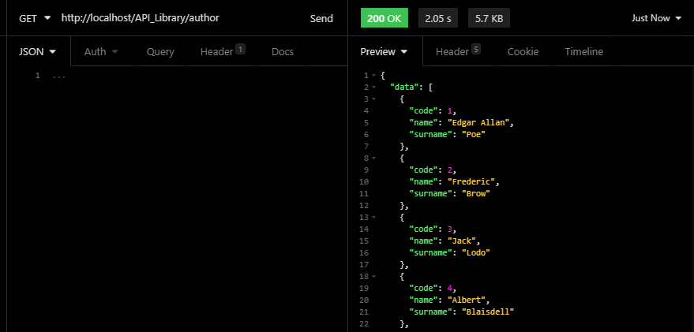
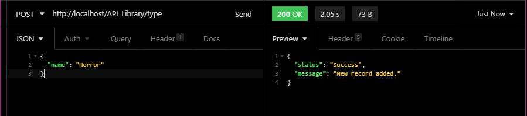

# API Librery 📘

The following HTTP request methods were used for this project.

| Método HTTP | Descripción                      |
| ----------- | -------------------------------- |
| GET         | Gets all records. |
| GET/1       | Get a record ID 1.  |
| POST        | Add a new record.          |
| PUT/1       | Update a record with ID 1.  |
| DELETE/1    | Delete a record with ID 1.    |


# API 💜

To test the API you can use [Insomnia](https://insomnia.rest/download/), and configure the requests depending on the project path.


## Borrow 	💀 

**1.** Get borrows: **GET: http://localhost/API_Library/borrow**


**2.** Get borrow by id: **GET : http://localhost/API_Library/borrow/100**


**3.** Get borrow by dates: **GET : http://localhost/API_Library/borrow/2021-01-01/2021-03-31**


**4.** New borrow: **POST: http://localhost/API_Library/borrow**

> In the body of the json put the following structure.

```json
    {
      "studentCode": 400,
      "bookCode": 105,
      "broughtDate": "2001-05-01",
      "takenDate": "2002-07-04"
    }
 ```


**5.** Update borrow: **PUT http://localhost/API_Library/borrow/100**

> In the body of the json put the following structure.

```json
    {
      "studentCode": 400,
      "bookCode": 105,
      "broughtDate": "2001-05-01",
      "takenDate": "2002-07-04"
    }
 ```



**6.** Delete borrow: **DELETE : http://localhost/API_Library/borrow/100**


## Book 🌜 

**1.** Get books: **GET: http://localhost/API_Library/book**


**2.** Get book by id: **GET : http://localhost/API_Library/book/100**


**3.** New book: **POST: http://localhost/API_Library/book**

> In the body of the json put the following structure.

```json
{
  "name": "add book",
  "pages": 1050,
  "point": 100,
  "authorCode": 11,
  "typeCode": 12
}
 ```


**4.** Update book: **PUT http://localhost/API_Library/book/100**

> In the body of the json put the following structure.

```json
{
  "name": "update book",
  "pages": 1050,
  "point": 100,
  "authorCode": 11,
  "typeCode": 12
}
 ```


**5.** Delete book: **DELETE : http://localhost/API_Library/book/100**


## Author 	💀 

**1.** Get students: **GET: http://localhost/API_Library/author**



**2.** Get author by id: **GET : http://localhost/API_Library/author/100**


**3.** New author: **POST: http://localhost/API_Library/author**
> In the body of the json put the following structure.

```json
{
  "name": "add name",
  "surname": "add surname"
}
 ```
 


**4.** Update author: **PUT http://localhost/API_Library/author/100**

> In the body of the json put the following structure.

```json
{
  "name": "update name",
  "surname": "update surname"
}
 ```
 


**5.** Delete author: **DELETE : http://localhost/API_Library/author/100**


## Student 🌜 

**1.** Get students: **GET: http://localhost/API_Library/student**


**2.** Get student by id: **GET : http://localhost/API_Library/student/100**


**3.** New student: **POST: http://localhost/API_Library/student**

> In the body of the json put the following structure.

```json
   {
      "name": "name",
      "surname": "surname",
      "birthday": "0000-00-00",
      "gender": "F",
      "point": 000,
      "class": "class"
    }
 ```
 


**4.** Update student: **PUT http://localhost/API_Library/student/100**

> In the body of the json put the following structure.

```json
   {
      "name": "name",
      "surname": "surname",
      "birthday": "0000-00-00",
      "gender": "F",
      "point": 000,
      "class": "class"
    }
 ```
 


**5.** Delete student: **DELETE : http://localhost/API_Library/student/100**


## Type 	💀 

Type of books example: horror, suspense...

**1.** Get types: **GET: http://localhost/API_Library/type**


**2.** Get types by id: **GET : http://localhost/API_Library/type/100**


**3.** New type: **POST: http://localhost/API_Library/type**


> In the body of the json put the following structure.

```json
{
  "name": "New type"
}
```



**4.** Update type: **PUT http://localhost/API_Library/type/100**

> In the body of the json put the following structure.

```json
{
  "name": "Update type"
}
```


**5.** Delete type: **DELETE : http://localhost/API_Library/type/100**

